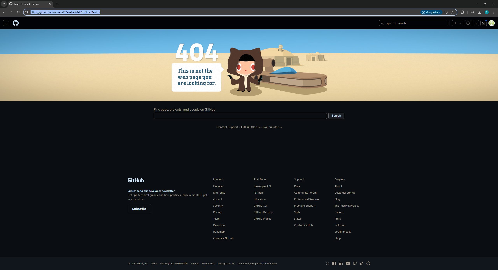

# EC 0.6 - Reports
### Ethan Benton
### CS 432, Fall 2024
### 9/8/2024

# Q1

*You may copy the question into your report, but make sure that you make it clear where the question ends and your answer begins.*

## Answer

The example figure below shows the growth in the number of websites between 1993 and 1996.



*If you want to include code in your report, you can insert a screenshot (if it's legible), or you can copy/paste the code into a fenced code block.*

```python
#!/usr/local/bin/python3
# friend-count.py

import csv

# Read the CSV file
filename = 'friend-count.csv'
data = {}

with open(filename, newline='') as csvfile:
    reader = csv.reader(csvfile)
    next(reader)  # Skip the header row if it exists
    for row in reader:
        name, friends = row[0].strip(), row[1].strip()  # Remove any extra spaces
        try:
            friends = int(friends)  # Convert the number of friends to an integer
        except ValueError:
            print(f"Skipping row with invalid data: {row}")
            continue  # Skip rows where the number of friends is not a valid integer

        first_letter = name[0].upper()  # Get the first letter of the user's name

        # Check if the letter already exists in the dictionary
        if first_letter not in data:
            data[first_letter] = {'users': 0, 'total_friends': 0}

        # Update the counts for the first letter
        data[first_letter]['users'] += 1
        data[first_letter]['total_friends'] += friends

# Print the results
for letter in sorted(data):
    print(f"{letter} - {data[letter]['users']} users, {data[letter]['total_friends']} total friends")

# Write the results to a file
with open('output.txt', 'w') as outfile:
    for letter in sorted(data):
        outfile.write(f"{letter} - {data[letter]['users']} users, {data[letter]['total_friends']} total friends\n")
```

The table below shows a simple table.  

|Week|Date|Topic|
|:---|:---|:---|
|1|Aug 24|Introduction to Web Science and Web Architecture|
|2|Aug 31|Introduction to Python|
|3|Sept 7|Measuring the Web|
|4|Sept 14|Searching the Web|

The table below shows an example confusion matrix (you'll see this term later) from <https://en.wikipedia.org/wiki/Confusion_matrix>.

| | |Actual||
|---|---|---|---|
|**Predicted**| |Cat|Dog|
| |Cat|5 (TP)|3 (FP)|
| |Dog|2 (FN)|3 (TN)|

*You must provide some discussion of every answer. Discuss how you arrived at the answer and the tools you used. Discuss the implications of your answer.*

# Q2

## Answer

# Q3

## Answer

# References

*Every report must list the references that you consulted while completing the assignment. If you consulted a webpage, you must include the URL.  These are just a couple examples.*

* Stack Overflow, How can I parse (read) and use JSON in Python?, <https://stackoverflow.com/questions/7771011/how-can-i-parse-read-and-use-json-in-python>
* ChatGPT conversation, Initial prompt: "write a python line to detect if a string ends with .png", <https://chat.openai.com/share/5de76e93-c26b-4665-a0fc-b782b01a9285>
* Introduction to Python, <https://introtopython.org/>
* Python, <https://www.python.org/>
* w3schools, <https://www.w3schools.com/python/python_examples.asp>
